## **Welcome to Day 4 of the Bootcamp!!!**
Today, we'll be learning how **image recognition** happens, and how **Deep Learning (DL)** works!
CNN_Model_Training colab link: [CNN_Model_Training](https://colab.research.google.com/drive/11mLrtD7BT0J9wWm1ugqtHlw1g81FfiAl?usp=sharing)
---

## **1. Artificial Neural Networks (ANNs)**

### **1.1 What are ANN's?**
An **Artificial Neural Network (ANN)** is a type of model in Deep Learning that tries to work like the human brain — it learns by finding patterns in data.

- Just like our brain has neurons that send signals to each other, an ANN has **artificial neurons (nodes)** connected in layers that pass information forward and adjust themselves to learn.
- ANN is made up of layers of neurons:
  - **Input Layer**: Receives the data.
  - **Hidden Layers**: Where the actual learning happens — the model adjusts its weights and biases for each neuron during training.
  - **Output Layer**: Produces the final prediction.

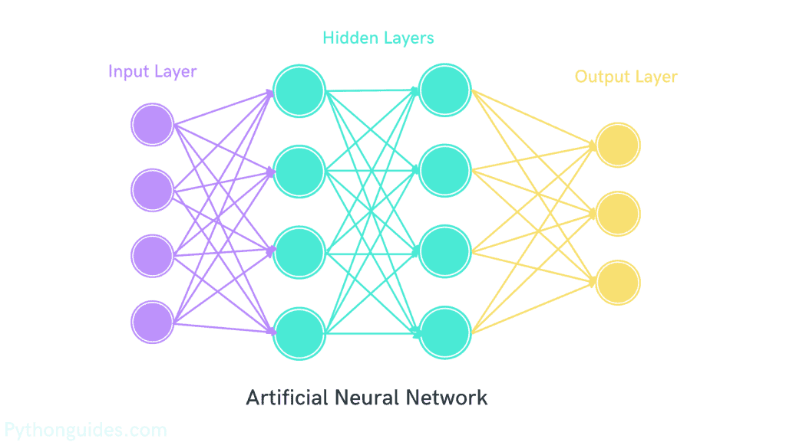

```python
# Define the model
model = Sequential([
    Input(shape=(4,)),            # Input layer (4 features)
    Dense(4, activation='relu'),  # Hidden layer 1
    Dense(4, activation='relu'),  # Hidden layer 2
    Dense(3, activation='sigmoid') # Output layer (multi-class classification)
])

# Compile the model
model.compile(optimizer='adam', loss='binary_crossentropy', metrics=['accuracy'])
```

### **1.2 Key Terms**
- **Activation Function**: Adds non-linearity (mathematically) for a neuron, so the model can learn complex patterns instead of simple linear ones.
- **Optimizers**: Algorithms that improve model learning by adjusting weights and biases during training to reduce error.
- **Loss Function**: Measures how wrong the model’s predictions are — the model tries to minimize this loss while learning.

---

## **2. Convolutional Neural Networks (CNNs)**

### **2.1 What are CNN's?**
A **Convolutional Neural Network (CNN)** is a type of Deep Learning model specifically designed to handle **grid-like data**, such as images. Images are represented as matrices (2D for grayscale or 3D for RGB) where each element corresponds to a pixel intensity. Parameters are learnable values that the model learns during training, and the parameters that get learnt here are weights and biases.

- Instead of looking at the whole image at once, CNNs look at **small local regions (patches)** to learn patterns like edges, textures, shapes, and then combine them to recognize higher-level features.
- **Applications**: Image classification, object detection, face recognition, medical imaging, etc.
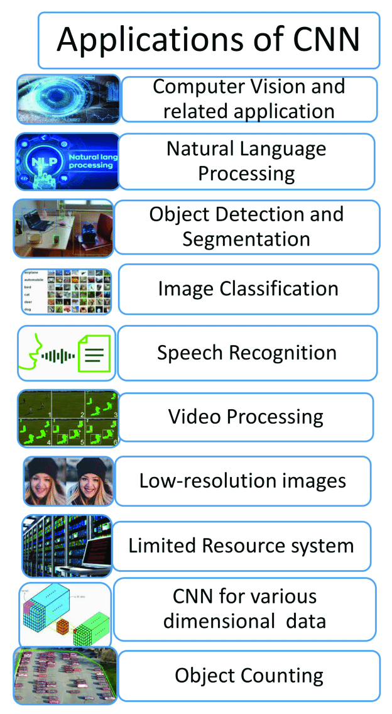

### **2.2 How CNNs Work?**
A CNN has **three main types of layers**:

#### **2.2.1 Convolution Layer**
- Responsible for finding features in the data, such as edges, shapes, and textures using **strides** and **kernels**.
- Strides determine how the filter traverses the input image. A stride of 1 indicates that the filter moves 1 pixel at a time, whereas stride of 2 moves 2 pixels at a time. Higher strides produce smaller output feature maps.  
- In a convolutional layer, the kernel (or filter) is a small square matrix that slides over the image to detect patterns like edges or textures. To control the size of the output after this sliding, we use padding.
- Padding is used to control how much the size of an image or feature map shrinks during convolution. With same padding, we add zeros around the edges so that the filter can slide over the image without reducing its size, keeping the output the same height and width as the input. With valid padding, we add no extra zeros, so the filter only moves within the original image boundaries, which naturally makes the output smaller.  
Output size calculation:  
  ```Output size =  (((Input size-Kernel size)+ 2*Padding)/Stride) + 1 ```

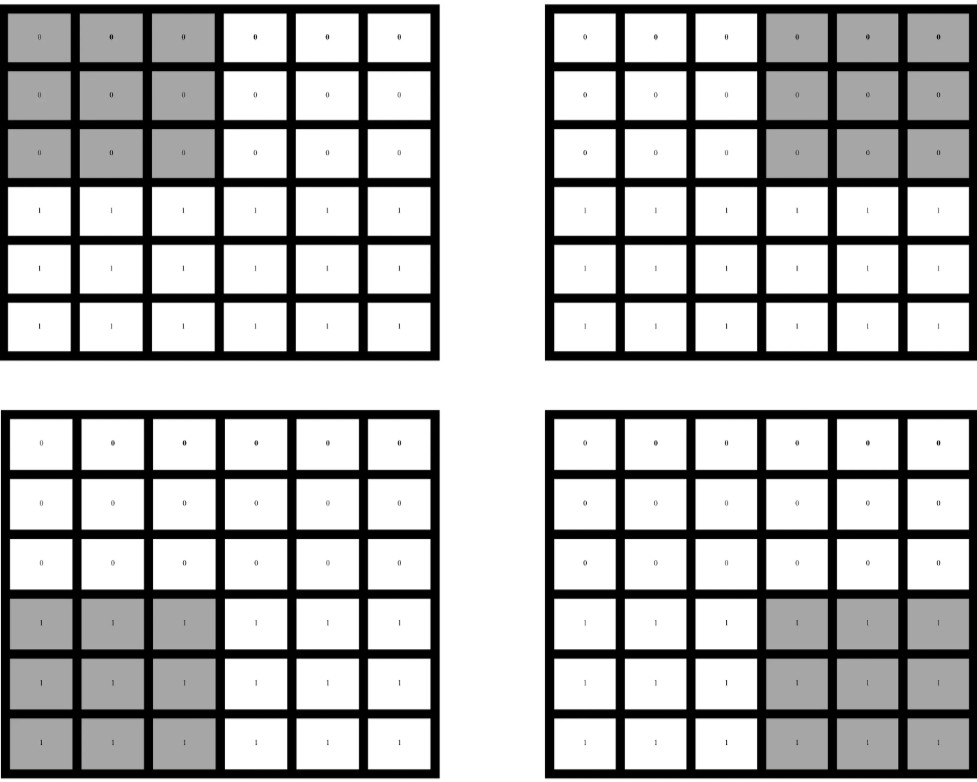

#### **2.2.2 Pooling Layer**
- Reduces the size of the feature maps to make computation easier while retaining the most important features.
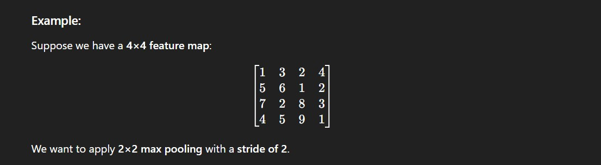
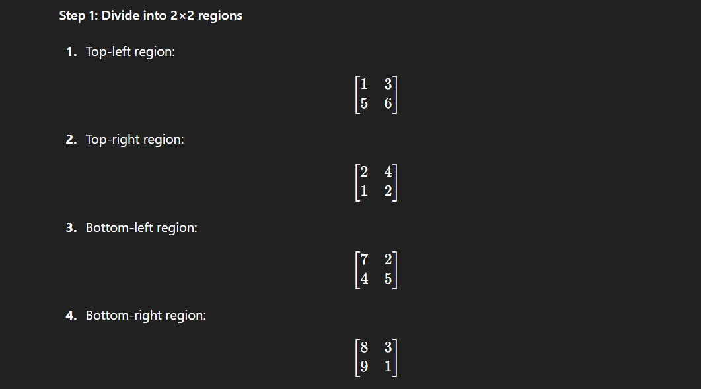
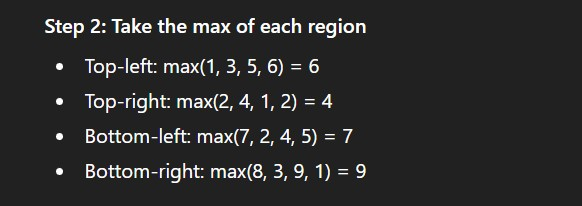
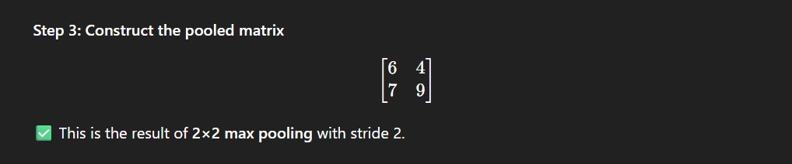


#### **2.2.3 Fully Connected Layer**
- Predicts the outcome based on the extracted features passed to it.

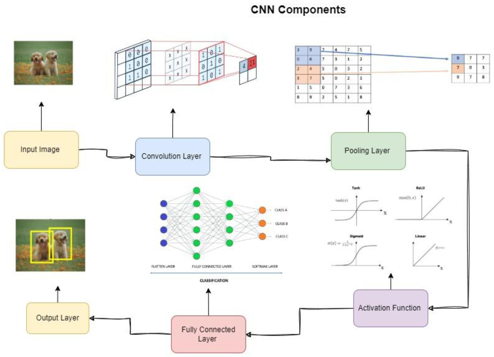
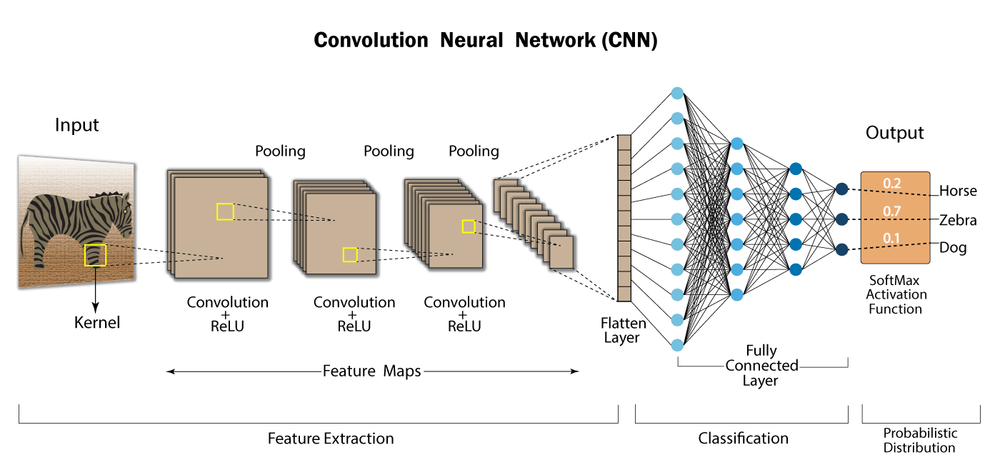

---

## **3. Basic Evolution of CNN**

### **3.1 LeNet (1998)**
- One of the earliest CNNs, designed for handwritten digit recognition (e.g., MNIST dataset).
- Introduced **convolution** and **pooling layers**.

### **3.2 AlexNet (2012)**
- Popularized deep CNNs by winning the ImageNet competition.
- Used **ReLU activation**, **dropout**, and **GPU training**.

### **3.3 VGGNet (2014)**
- Used very deep networks with small (3×3) convolution filters.
- Demonstrated that **increasing depth improves performance**.

### **3.4 GoogLeNet/Inception (2014)**
- Introduced **inception modules** for multi-scale feature extraction.
- Used **global average pooling** instead of fully connected layers.

### **3.5 ResNet (2015)**
- Introduced **residual connections (skip connections)** to solve vanishing gradient problems.
- Enabled training of very deep networks (50+ layers).

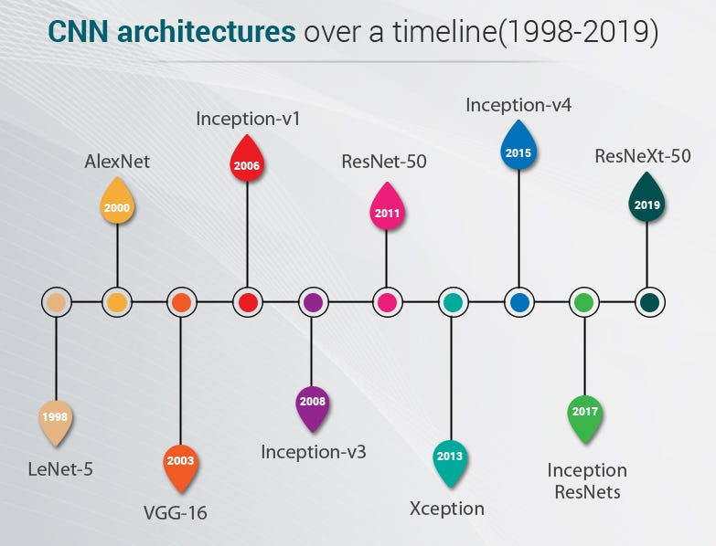

---

## **4. Differences between ANN and CNN**

| **Aspect**            | **ANN (Artificial Neural Network)** | **CNN (Convolutional Neural Network)** |
|------------------------|-------------------------------------|-----------------------------------------|
| **Main Idea**          | Fully connected layers that learn global patterns | Uses convolutional filters to learn local spatial patterns |
| **Typical Input**      | 1D feature vectors (tabular data)  | 2D/3D grid data (images, videos, volumes) |
| **Connectivity**       | Dense connections between neurons  | Local connectivity (receptive fields) + sparse connections |
| **Parameter Sharing**  | No (each weight is unique)         | Yes (same filter applied across spatial locations) |
| **Feature Learning**   | Learns global relationships        | Learns hierarchical features (edges → textures → objects) |
| **Translation Invariance** | Limited                       | Stronger (due to convolutions and pooling) |
| **Common Layers**      | Dense (fully connected), activation | Convolution, pooling, batch norm, fully connected |
| **Typical Use Cases**  | Tabular data, simple classification/regression | Image classification, object detection, segmentation |

---

## **5. Different Famous CNN Architectures (Concise Specs)**

### **5.1 LeNet-5 (1998)**
- **Input**: 32×32 grayscale
- **Convs**: 3 conv layers (C1: 6 filters, C3: 16 filters, C5: 120 filters) + pooling layers
- **Fully Connected**: 2 (F6 and output)
- **Total Params**: ~60k
- **Notes**: Designed for MNIST; simple, small model for digit recognition.
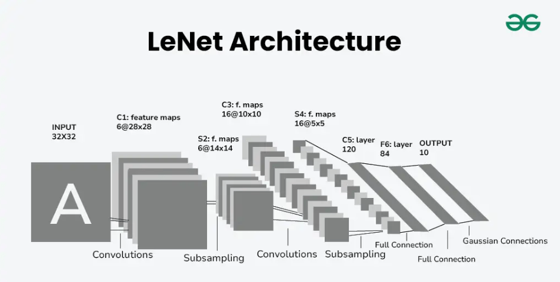

### **5.2 AlexNet (2012)**
- **Input**: 224×224 RGB (original used 227×227)
- **Convs**: 5 conv layers + max-pooling layers
- **Fully Connected**: 3 FC layers
- **Total Params**: ~60M
- **Notes**: ReLU, dropout, GPU training, large kernels in early layers (11×11, 5×5).
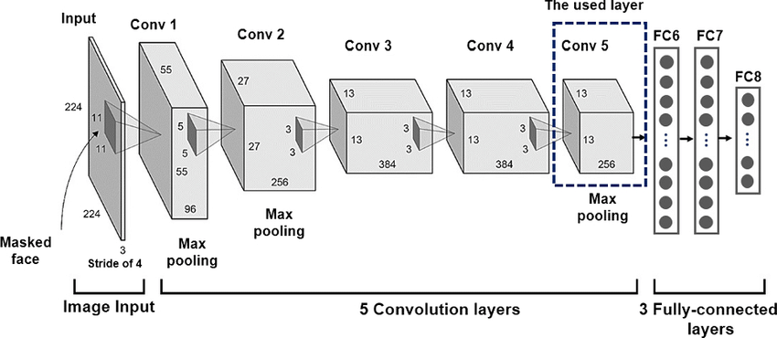

### **5.3 VGG (2014) — e.g., VGG-16 / VGG-19**
- **Input**: 224×224 RGB
- **Convs**: VGG-16 = 13 conv layers (stacked 3×3 filters) + 5 max-pool layers; VGG-19 = 16 conv
- **Fully Connected**: 3 FC layers
- **Total Params**: VGG-16 ≈ 138M
- **Notes**: Very deep with uniform 3×3 filters; high parameter count.
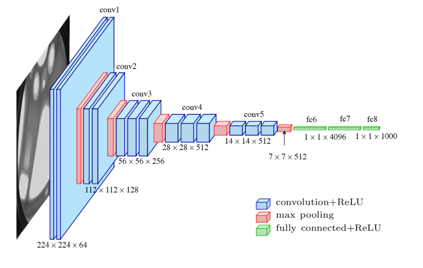

### **5.4 ResNet (2015)**
- **Input**: 224×224 RGB
- **Convs**: ResNet-50 uses bottleneck blocks totaling 49 conv layers + 1 FC (counted as 50); ResNet-101 deeper
- **Fully Connected**: 1 final FC (after global pooling)
- **Total Params**: ResNet-50 ≈ 25M
- **Notes**: Residual (skip) connections that enable very deep networks and ease training. Skip connections were added to make deep networks trainable.
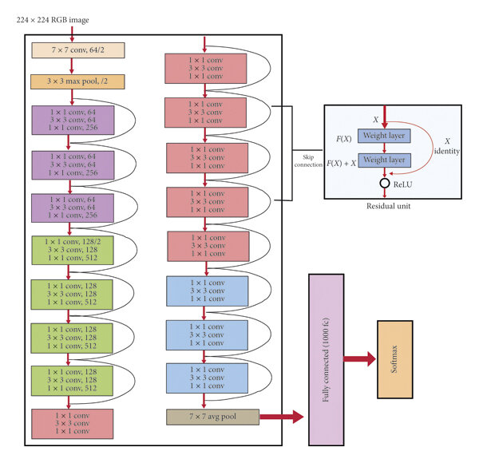

---

## **6. Advantages and Disadvantages of CNN**

### **6.1 Advantages**
- **Learns hierarchical spatial features** (edges → textures → objects).  
- **Parameter sharing & local connectivity** → fewer parameters and efficient learning for images.  
- **State-of-the-art** for vision tasks and has efficient variants for edge/mobile.  
- **Robust to translation, scaling, and rotation** due to convolution and pooling layers.  
- **Feature extraction is automatic** — no need for manual feature engineering.  
- **Versatility** — can be applied to images, videos, and even sequential data like audio or text (with modifications).  

### **6.2 Disadvantages**
- **Data hungry** — needs large labeled datasets for best performance.  
- **Compute and memory intensive** (training often requires GPUs/TPUs).  
- **Can overfit** on small datasets.  
- **Lack of interpretability** — CNNs are often considered "black boxes" due to their complexity.  
- **Requires significant hyperparameter tuning** (e.g., kernel size, stride, number of filters) for optimal performance.  

---

## **7. Hosting on Hugging Face**

### **7.1 Prerequisites**
- **Hugging Face account**: [Sign up here](https://huggingface.co/)
- **Git and Git LFS installed**:
  - Windows: `git lfs install`
- **Python packages**:
  ```bash
  pip install huggingface_hub torch torchvision
  ```
- Train your CNN locally and save artifacts (weights, optional config, and helper code).

### **7.2 Steps to Host**
1. **Save model artifacts** (e.g., `pytorch_model.bin`, `config.json`, `model.py`).
2. **Create a repo** on Hugging Face (via CLI or web).
3. **Push files** using Git + LFS or Python API.
4. **Add a README** (model card) with usage instructions.
5. **Enable Inference API** (optional).

---

### **7.3 Notes / Tips**
- Use **Git LFS** for large weight files (>10 MB).
- Provide a **model.py** file to help others reconstruct the architecture.
- Add a **README.md** with usage, dataset, license, and metrics.
- Enable the **Inference API** for remote inference directly on Hugging Face.